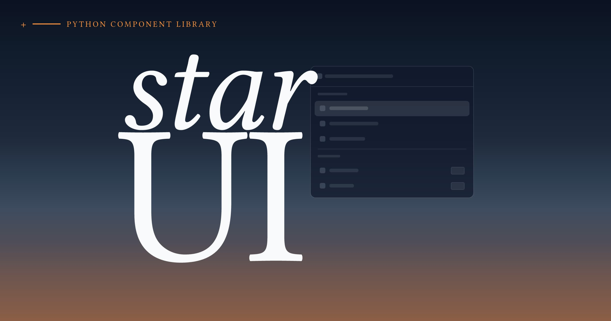

<div align="center">

<a href="https://starhtml.com"></a>

<a href="https://ui.starhtml.com"></a>


**Python-first UI component library for [StarHTML](https://starhtml.com). shadcn/ui components with zero-configuration setup.**

[Documentation](https://ui.starhtml.com) · [StarHTML](https://starhtml.com) · [Quick Start](#quick-start) · [Issues](https://github.com/banditburai/starui/issues)

</div>

## Quick Start

```bash
uv add starui
```

```python
from starhtml import *
from starui import *

app, rt = star_app()

@rt("/")
def home():
    return Card(
        CardHeader(
            CardTitle("Welcome to StarUI")
        ),
        CardContent(
            Button("Get Started", variant="default"),
            Button("Learn More", variant="outline")
        )
    )

serve()
```

## Available Components

| Component | Description | Variants |
|-----------|-------------|----------|
| **Button** | Interactive buttons | `default`, `destructive`, `outline`, `secondary`, `ghost`, `link` |
| **Alert** | Important messages | `default`, `destructive` |
| **Badge** | Status indicators | `default`, `secondary`, `destructive`, `outline` |
| **Card** | Content containers | Header, Content, Footer sections |
| **Input** | Form inputs | All HTML input types with validation |
| **Label** | Form labels | Accessible form labeling |

## CLI

```bash
star init <project-name>          # Create new project
star add <component>              # Add component to project
star list                         # List available components
star dev <app.py>                 # Dev server with hot reload
star build                        # Build production CSS
```

## Component API

### Button

```python
Button("Click me")

Button(
    "Submit Form",
    variant="default",
    size="lg",
    disabled=False,
    type="submit",
    onclick="handleSubmit()"
)
```

### Card

```python
Card(
    CardHeader(
        CardTitle("Product Card")
    ),
    CardContent(
        P("This is the card content with detailed information."),
        Button("Learn More", variant="outline")
    ),
    class_name="max-w-md"
)
```

## Configuration

StarUI works with zero configuration, but you can customize it:

```python
# starui.config.py (optional)
from starui.config import ProjectConfig
from pathlib import Path

config = ProjectConfig(
    project_root=Path.cwd(),
    css_output=Path("static/css/starui.css"),
    component_dir=Path("components/ui")
)
```

## Development

```bash
git clone https://github.com/banditburai/starui.git
cd starui
uv sync --all-extras
uv run ruff check && uv run pyright && uv run pytest tests/ -v
```

Contributions welcome — see [CONTRIBUTING.md](CONTRIBUTING.md).

## Acknowledgments

Built on [shadcn/ui](https://ui.shadcn.com/) design patterns, [StarHTML](https://starhtml.com), and [Tailwind CSS](https://tailwindcss.com/).
